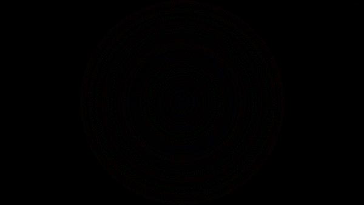

# Circular Arrays
[Python 3.8](https://www.python.org/) software to visualise an array using circles, using common sorting algorithms to visualise how this algorithms are working.
## Installation

Use the package manager [pip](https://pip.pypa.io/en/stable/) to install PyGame.

```bash
pip install pygame
```

## Usage
With PyGame installed, open Main.py file with Python 3.8, and follow the steps.

## Example Video

